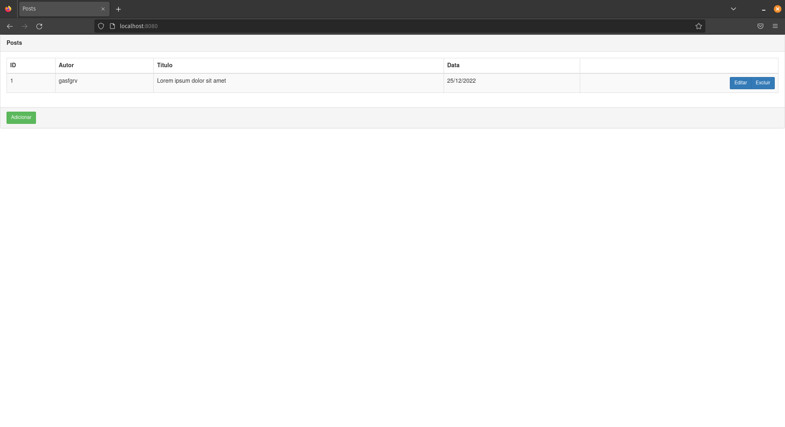
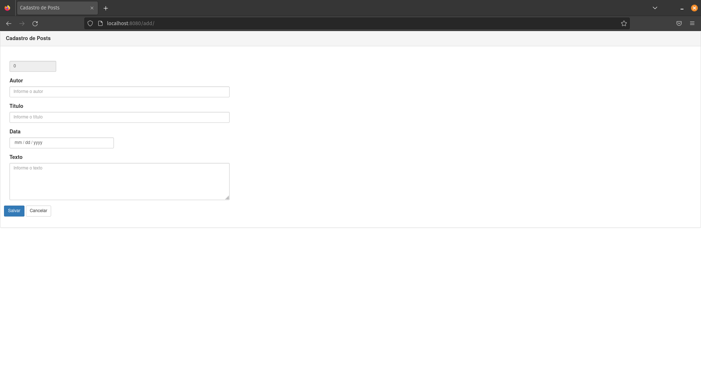
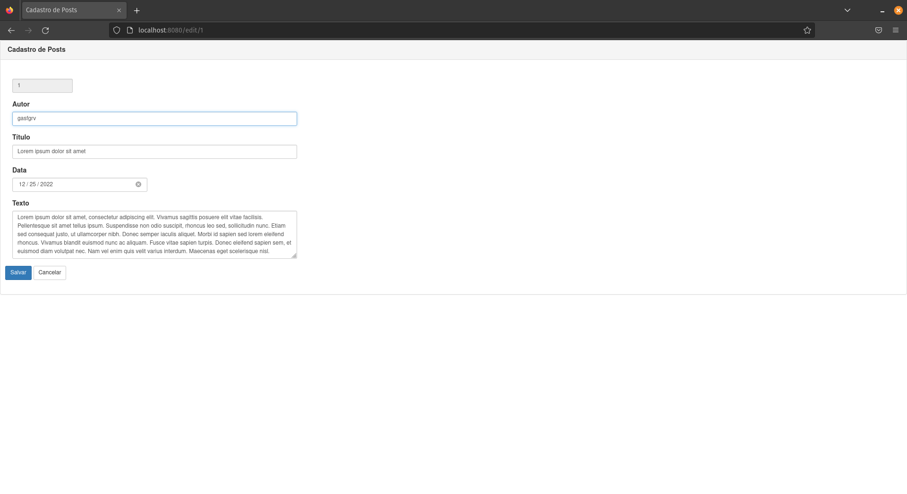

# Blog CRUD

Aplicação de CRUD para posts em um blog usando Java Spring Boot e Thymeleaf para fazer as telas, além de uma base de
dados postgres.

## Features

- [x] CRUD completo de posts

## Telas da Aplicação

**Tela inicial da aplicação**



**Abre formulário para o cadastro do post**



**Abre formulário para o edição do post**



## Rotas

| Método |      Rota      |                  Função                  |
|:------:|:--------------:|:----------------------------------------:|
|  GET   |      `/`       |        Tela inicial da aplicação         |
|  GET   |     `/add`     | Abre formulário para o cadastro do post  |
|  GET   |  `/edit/{id}`  |  Abre formulário para o edição do post   |
|  GET   | `/delete/{id}` |       Deleta o post da base dados        |

## Como rodar a aplicação

Criar o arquivo docker-compose:

```yaml
version: "3.7"
services:
  postgres_db:
    image: postgres:latest
    container_name: database
    restart: always
    networks:
      - blog
    ports:
      - "5432:5432"
    environment:
      POSTGRES_DB: blog
      POSTGRES_PASSWORD: postgres
      POSTGRES_USER: postgres

networks:
  blog:
    driver: bridge
```

Rodar os seguintes comandos

```shell
docker pull gustosilva/blog-app

docker run -d \
  --net blog_blog \
  -p 8080:8080 gustosilva/blog-app
```

## Dependências

- Spring Boot: 2.2.2
- spring-boot-starter-data-jpa
- spring-boot-starter-thymeleaf
- spring-boot-starter-web
- spring-boot-devtools
- postgresql
- spring-boot-starter-test
- slf4j-api: 1.7.30

